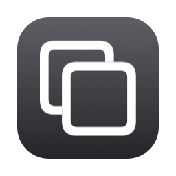

# SpaceTab

A Cmd+Tab-style app switcher for macOS that only lists apps with a window on the
**current Space**.

Built to stay responsive over high-latency screen sharing. 



## Requirements

- macOS 13 or later
- Xcode Command Line Tools (`xcode-select --install`) — full Xcode not required

## Build and install

```sh
git clone https://github.com/emp/SpaceTab.git
cd SpaceTab
./install.sh
```

`install.sh` builds a release binary, assembles `SpaceTab.app`, installs it to
`/Applications`, and launches it. 

To build without installing, run `./build.sh` and open `build/SpaceTab.app`.

The app lives in the menu bar and has no Dock icon. Quit it from there.

### Accessibility permission required

The menu bar icon shows a warning triangle while the hotkey is not live, and the
menu reads `Active` once it is.

## Usage


## Start at login

System Settings → General → Login Items → `+` → SpaceTab.

## License

MIT — see [LICENSE](LICENSE). Provided as is, without warranty of any kind.
